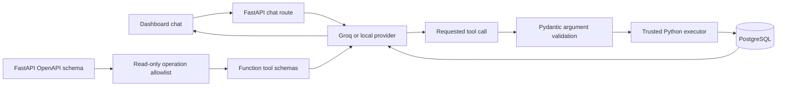

# Dashboard LLM architecture

This document records the provider and tool architecture as of August 14,
2026. The most important distinction is that Groq's API specification and this
application's Swagger document have different jobs.

## Groq API surface

Groq exposes an OpenAI-compatible API at `https://api.groq.com/openai/v1`.
The dashboard currently needs only `POST /chat/completions`, including its
messages, function tools, `tool_choice`, and `parallel_tool_calls` fields.
Groq also offers Responses, audio, models, batches, files, and fine-tuning APIs,
but they are outside this dashboard's current request path.

Primary references:

- [Groq API reference](https://console.groq.com/docs/api-reference)
- [Groq OpenAI compatibility](https://console.groq.com/docs/openai)
- [Groq local tool calling](https://console.groq.com/docs/tool-use/local-tool-calling)

Chat Completions remains the shared provider contract because both Groq and
local Ollama models support it, including function tools. Moving to the
Responses API would not improve the database security boundary and would make
the first multi-provider implementation less portable.

## Application Swagger/OpenAPI surface

FastAPI generates the application's `/openapi.json` (and renders it at
`/docs`). At startup, `build_tools_from_openapi` reads that document and keeps
only GET operations whose `operationId` is also present in
`APPROVED_CHAT_OPERATIONS`.

The resulting JSON schemas are sent to the selected model as function tools.
They are not Groq endpoints, and the model never calls FastAPI routes directly.
The server validates the chosen tool and arguments, then calls a trusted Python
executor with the current SQLAlchemy session.

## Security invariants

1. Only explicitly registered GET operations become model tools.
2. Tool argument models use `extra="forbid"` and field constraints.
3. Models receive neither SQL nor a database connection.
4. POST, PUT, and DELETE operations never enter the tool list.
5. Database results are treated as untrusted data when generating an answer.
6. The server owns provider keys; the browser never receives them.

## Provider boundary

`ChatProvider` describes a name, model, base URL, key, and timeout.
`run_provider_tool_chat` owns the common two-request sequence:

1. require a validated read tool call;
2. execute the approved operation on the server;
3. send the structured result back without tools for a final explanation.

This boundary keeps the tool loop identical for Groq and OpenAI-compatible
local servers. Provider selection belongs to the LangGraph workflow described
in the next roadmap item, not to the database or tool executors.
